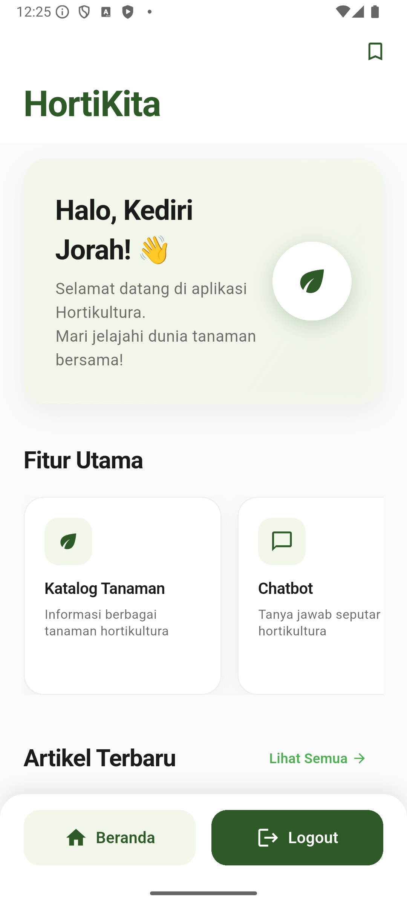
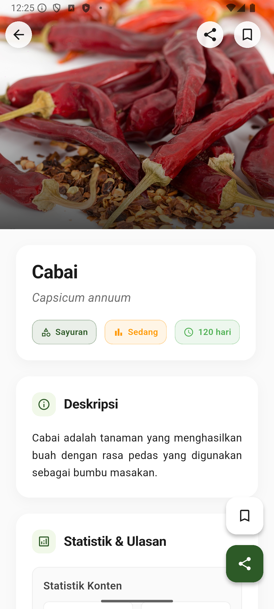
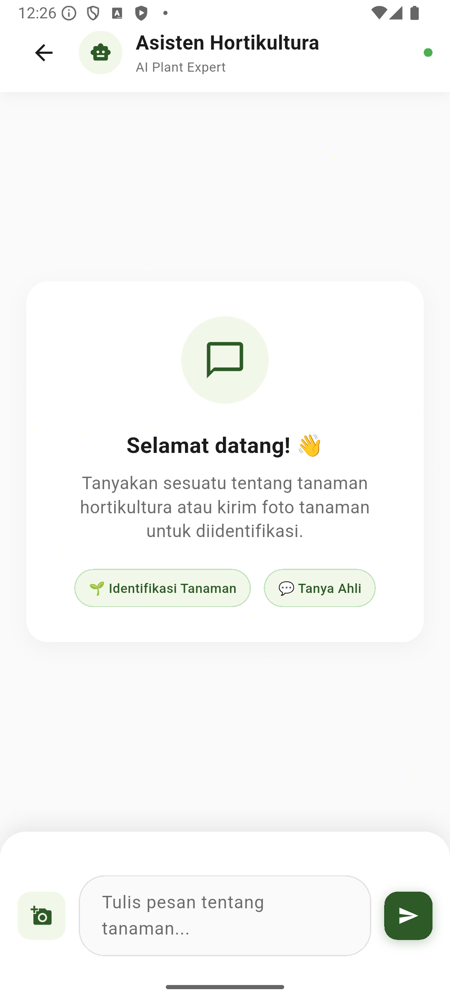
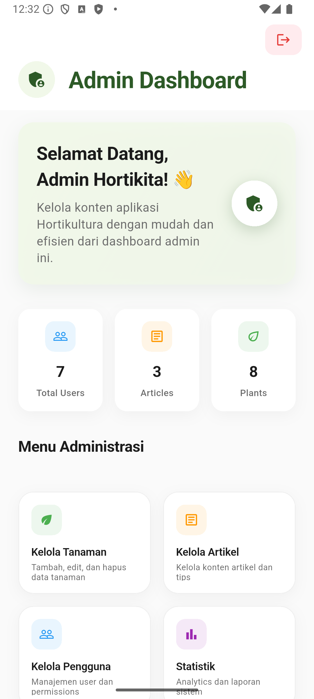

# 🌱 HortiKita - Smart Horticulture Companion

<p align="center">
  
</p>

<p align="center">
  <strong>Empowering Indonesian Gardeners with AI-Powered Plant Care Solutions</strong>
</p>

<p align="center">
  
  
  
  
  
  
</p>

---

## 📋 About HortiKita

**HortiKita** is a comprehensive mobile application designed to revolutionize horticulture practices in Indonesia. Built with Flutter and powered by advanced AI technology, this app serves as your personal gardening companion, offering expert advice, comprehensive plant databases, and intelligent chat assistance for all your gardening needs.

### 🎯 Mission
To democratize horticultural knowledge and make sustainable gardening accessible to everyone in Indonesia through cutting-edge technology and community-driven insights.

### 🏆 Key Achievements
- ✅ **Production-Ready**: Full email verification & secure authentication
- ✅ **AI-Powered**: Integration with Google Gemini 2.0 Flash
- ✅ **Security-First**: Environment-based API key management
- ✅ **Scalable Architecture**: Clean code with SOLID principles
- ✅ **User-Focused**: Modern UI/UX with accessibility in mind

---

## ✨ Core Features

### 🤖 **Intelligent AI Chatbot**
- **Instant Expert Advice**: Get personalized plant care recommendations
- **Multi-Modal Support**: Text and image-based plant diagnosis
- **Local Context**: Advice tailored for Indonesian climate and conditions
- **24/7 Availability**: Always ready to help with your gardening questions

### 📚 **Comprehensive Plant Database**
- **1000+ Plant Species**: Detailed information on vegetables, fruits, ornamentals, and herbs
- **Step-by-Step Guides**: Complete planting and care instructions
- **Growth Tracking**: Monitor your plants' development stages
- **Disease & Pest Management**: Identification and treatment guides

### 📰 **Expert Articles & Resources**
- **Latest Research**: Up-to-date horticultural findings and practices
- **Seasonal Guides**: Month-by-month planting calendars
- **Organic Methods**: Sustainable and eco-friendly gardening techniques
- **Local Expertise**: Content curated for Indonesian gardeners

### 👤 **Personalized Experience**
- **Secure Authentication**: Email verification and robust user management
- **Personal Dashboard**: Track your favorite plants and articles
- **Achievement System**: Gamified learning experience
- **Community Features**: Connect with fellow gardening enthusiasts

### 📊 **Analytics & Insights**
- **User Engagement Tracking**: Understand your gardening journey
- **Content Performance**: See what works best for your plants
- **Growth Analytics**: Visualize your gardening progress
- **Admin Dashboard**: Comprehensive management tools

---

## 🛠️ Technology Stack

### **Frontend & Mobile**
- **Flutter 3.7.0+** - Cross-platform mobile framework
- **Dart** - Programming language optimized for UI
- **Material Design 3** - Modern, accessible UI components
- **Provider** - Robust state management solution

### **Backend & Cloud**
- **Firebase Suite**:
  - 🔐 **Authentication** - Secure user management with email verification
  - 🗄️ **Cloud Firestore** - Real-time NoSQL database
  - 📁 **Cloud Storage** - Scalable file storage
  - 📊 **Analytics** - User behavior insights
- **Firestore Security Rules** - Advanced data protection

### **AI & Machine Learning**
- **Google Gemini 2.0 Flash** - Latest multimodal AI for intelligent responses
- **Natural Language Processing** - Understanding Indonesian gardening contexts
- **Image Recognition** - Plant identification and disease detection

### **Development & DevOps**
- **Clean Architecture** - Maintainable and scalable codebase
- **Environment Variables** - Secure configuration management
- **Automated Testing** - Unit and integration test coverage
- **CI/CD Ready** - Prepared for automated deployment

---

## 📱 Screenshots & Demo

<p align="center">
  
  
  
  
</p>

<p align="center">
  <em>Experience modern, intuitive design crafted for Indonesian gardeners</em>
</p>

---

## 🚀 Quick Start Guide

### **Prerequisites**
- **Flutter SDK**: 3.7.0 or higher
- **Dart SDK**: Latest stable version
- **Development Environment**: Android Studio, VS Code, or IntelliJ IDEA
- **Firebase Account**: For backend services
- **Google AI Studio Access**: For Gemini API key

### **Installation Steps**

#### 1. **Clone Repository**
```bash
git clone https://github.com/prassaaa/HortiKita.git
cd HortiKita
```

#### 2. **Environment Setup**
```bash
# Copy environment template
cp .env.example .env

# Edit .env file with your configuration
nano .env
```

Add your configuration:
```env
GEMINI_API_KEY=your_gemini_api_key_here
ENVIRONMENT=development
```

#### 3. **Install Dependencies**
```bash
flutter pub get
```

#### 4. **Firebase Configuration**
1. Create a new Firebase project at [Firebase Console](https://console.firebase.google.com/)
2. Add Android/iOS apps to your project
3. Download configuration files:
   - `google-services.json` → `android/app/`
   - `GoogleService-Info.plist` → `ios/Runner/`
4. Enable required services:
   - Authentication (Email/Password)
   - Cloud Firestore
   - Cloud Storage
   - Analytics

#### 5. **API Key Setup**
1. Visit [Google AI Studio](https://makersuite.google.com/app/apikey)
2. Create a new API key
3. Add the key to your `.env` file
4. Ensure proper permissions are enabled

#### 6. **Run Application**
```bash
# Development mode
flutter run

# Release mode
flutter run --release
```

---

## 📂 Project Architecture

### **Clean Architecture Implementation**
```
lib/
├── 🎯 app/                     # Application layer
│   └── constants/              # App-wide constants
├── 📊 data/                    # Data layer
│   ├── models/                 # Domain models
│   │   ├── article_model.dart
│   │   ├── chat_message_model.dart
│   │   ├── plant_model.dart
│   │   ├── user_model.dart
│   │   ├── analytics/          # Analytics models
│   │   └── user_engagement/    # Engagement tracking
│   ├── providers/              # State management
│   │   ├── auth_provider.dart
│   │   ├── chat_provider.dart
│   │   ├── plant_provider.dart
│   │   ├── article_provider.dart
│   │   ├── analytics_provider.dart
│   │   └── user_engagement_provider.dart
│   └── repositories/           # Data access layer
│       ├── plant_repository.dart
│       ├── article_repository.dart
│       └── chat_repository.dart
├── 🔧 services/               # Business logic services
│   ├── auth_service.dart
│   ├── firebase_service.dart
│   ├── gemini_service.dart
│   ├── analytics_service.dart
│   ├── environment_service.dart
│   ├── user_tracking_service.dart
│   └── user_engagement_service.dart
├── 🎨 ui/                     # Presentation layer
│   ├── screens/               # App screens
│   │   ├── auth/              # Authentication flow
│   │   │   ├── login_screen.dart
│   │   │   ├── register_screen.dart
│   │   │   └── email_verification_screen.dart
│   │   ├── home/              # Dashboard
│   │   ├── plants/            # Plant management
│   │   ├── articles/          # Content management
│   │   ├── chatbot/           # AI interaction
│   │   ├── favorites/         # User favorites
│   │   ├── admin/             # Admin panel
│   │   │   ├── admin_dashboard_screen.dart
│   │   │   ├── analytics_screen.dart
│   │   │   ├── manage_plants_screen.dart
│   │   │   ├── manage_articles_screen.dart
│   │   │   └── manage_users_screen.dart
│   │   └── splash/            # App initialization
│   ├── themes/                # UI theming
│   │   └── app_theme.dart
│   └── widgets/               # Reusable components
├── 🧪 test/                   # Testing utilities
└── main.dart                  # App entry point
```

### **Key Architectural Principles**
- **📦 Separation of Concerns**: Clear layer boundaries
- **🔄 Dependency Injection**: Flexible and testable code
- **🎯 Single Responsibility**: Each class has one job
- **🔒 Interface Segregation**: Minimal interface dependencies
- **🔧 Inversion of Control**: Depend on abstractions

---

## 🔐 Security Implementation

### **🛡️ Authentication & Authorization**
- **Email Verification**: Required before dashboard access
- **Role-Based Access**: User and admin role separation
- **Secure Session Management**: JWT-based authentication
- **Password Security**: Firebase Auth best practices

### **🔑 API Key Management**
```bash
# ✅ Secure (Current Implementation)
GEMINI_API_KEY=stored_in_env_file

# ❌ Insecure (Avoided)
const apiKey = "hardcoded_key_in_source"
```

### **🗄️ Data Protection**
- **Firestore Security Rules**: Granular access control
- **Input Validation**: Comprehensive data sanitization
- **Error Handling**: Secure error messaging
- **Audit Logging**: Track user actions and changes

---

## 🧪 Testing & Quality Assurance

### **Testing Strategy**
```bash
# Run all tests
flutter test

# Run tests with coverage
flutter test --coverage

# Widget testing
flutter test test/widget_test.dart

# Integration testing
flutter test integration_test/
```

### **Code Quality Tools**
```bash
# Static analysis
flutter analyze

# Code formatting
dart format lib/

# Dependency check
flutter pub deps
```

### **Performance Monitoring**
- **Firebase Performance Monitoring**: App performance metrics
- **Crashlytics**: Crash reporting and analysis
- **Custom Analytics**: User engagement tracking
- **Memory Management**: Efficient resource usage

---

## 🚀 Deployment & Distribution

### **Build Commands**

#### **Android**
```bash
# Debug build
flutter build apk --debug

# Release build
flutter build apk --release

# App Bundle (recommended for Play Store)
flutter build appbundle --release
```

#### **iOS**
```bash
# Debug build
flutter build ios --debug

# Release build
flutter build ios --release
```

### **Environment Configuration**

#### **Development**
```env
ENVIRONMENT=development
GEMINI_API_KEY=dev_api_key
FIREBASE_PROJECT_ID=dev_project
```

#### **Production**
```env
ENVIRONMENT=production
GEMINI_API_KEY=prod_api_key
FIREBASE_PROJECT_ID=prod_project
```

### **CI/CD Pipeline Ready**
- **GitHub Actions**: Automated testing and building
- **Fastlane**: Streamlined deployment process
- **Code Signing**: Automated certificate management
- **Version Management**: Semantic versioning support

---

## 👥 Contributing

We welcome contributions from the community! Here's how you can help:

### **🐛 Bug Reports**
1. Use the [GitHub Issues](https://github.com/prassaaa/HortiKita/issues) page
2. Search existing issues before creating new ones
3. Provide detailed reproduction steps
4. Include screenshots and device information

### **💡 Feature Requests**
1. Check the [project roadmap](#-roadmap--future-development)
2. Open a feature request issue
3. Describe the problem and proposed solution
4. Consider implementation complexity

### **🔧 Code Contributions**
```bash
# 1. Fork the repository
git fork https://github.com/prassaaa/HortiKita.git

# 2. Create feature branch
git checkout -b feature/amazing-feature

# 3. Make your changes
# Follow the existing code style and architecture

# 4. Test your changes
flutter test
flutter analyze

# 5. Commit with conventional commits
git commit -m "feat: add amazing new feature"

# 6. Push to your fork
git push origin feature/amazing-feature

# 7. Create Pull Request
```

### **📝 Development Guidelines**
- **Code Style**: Follow Dart/Flutter conventions
- **Documentation**: Update relevant documentation
- **Testing**: Add tests for new functionality
- **Performance**: Consider performance implications
- **Security**: Follow security best practices

---

## 🗺️ Roadmap & Future Development

### **🚀 Version 2.0 (Planned)**
- **🔍 Plant Disease Detection**: AI-powered camera diagnosis
- **🌦️ Weather Integration**: Location-based planting advice
- **📱 IoT Integration**: Smart sensor connectivity
- **🌐 Community Forum**: User interaction and knowledge sharing

### **🎯 Version 2.5 (Future)**
- **🛒 Marketplace**: Seeds and supplies e-commerce
- **📊 Advanced Analytics**: Predictive plant care
- **🎓 Learning Modules**: Interactive gardening courses
- **🌍 Multi-Language Support**: Expand beyond Indonesian

### **🔮 Long-term Vision**
- **🤖 AR Plant Recognition**: Augmented reality features
- **🌱 Sustainability Tracking**: Carbon footprint monitoring
- **🏢 Enterprise Solutions**: Commercial farming tools
- **🧬 Genetic Database**: Plant variety information

---

## 📊 Project Statistics

<p align="center">
  
  
  
  
  
  
</p>

---

## 📄 License & Legal

This project is licensed under the **MIT License** - see the [LICENSE](LICENSE) file for details.

For detailed legal information, third-party licenses, and attributions, please see [LEGAL.md](LEGAL.md).

### **Third-Party Acknowledgments**
- **Flutter Team**: Amazing cross-platform framework
- **Firebase**: Comprehensive backend services
- **Google AI**: Gemini API for intelligent features
- **Material Design**: Beautiful and accessible UI components
- **Open Source Community**: Countless packages and inspiration

---

## 📞 Support & Contact

### **📧 Get in Touch**
- **Email**: [me@pras.ari69@gmail.com](mailto:me@pras.ari69@gmail.com)
- **GitHub Issues**: [Report bugs or request features](https://github.com/prassaaa/HortiKita/issues)
- **Discussions**: [Community discussions and Q&A](https://github.com/prassaaa/HortiKita/discussions)

### **📚 Documentation**
- **[Setup Guide](SECURITY_IMPLEMENTATION_GUIDE.md)**: Detailed setup instructions
- **[API Documentation](docs/api.md)**: Backend API reference  
- **[Contributing Guide](CONTRIBUTING.md)**: How to contribute
- **[Changelog](CHANGELOG.md)**: Version history and updates
- **[Legal Information](LEGAL.md)**: Licenses and legal details

### **🆘 Support**
Having trouble? Check our [troubleshooting guide](docs/troubleshooting.md) or reach out to the community for help.

---

<p align="center">
  
</p>

<p align="center">
  <strong>Made with ❤️ for Indonesian gardeners</strong><br>
  <em>Empowering sustainable agriculture through technology</em>
</p>

<p align="center">
  <a href="#-about-hortikita">About</a> •
  <a href="#-core-features">Features</a> •
  <a href="#-quick-start-guide">Quick Start</a> •
  <a href="#-contributing">Contributing</a> •
  <a href="#-support--contact">Support</a>
</p>

---

<p align="center">
  <sub>⭐ Star this repository if you find it helpful!</sub>
</p>
